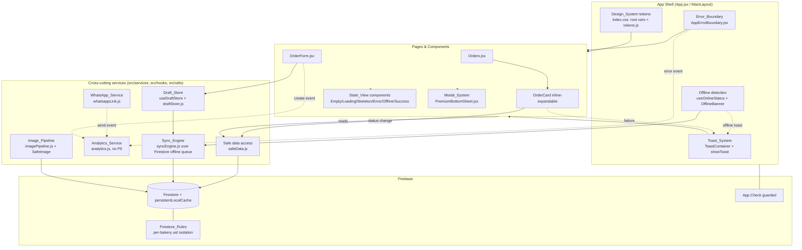

# Design Document

## Overview

This design hardens the existing Cream & Crust app (React 18 + Vite 6 + Firebase/Firestore, shipped as an installable PWA/TWA on Vercel) into a stable, native-feeling, production-grade bakery operating system. It does **not** introduce a new framework or backend rewrite. Instead it adds a small set of cross-cutting hardening layers and consolidates duplicated UI patterns onto the systems that already exist in the codebase.

The work spans 20 requirement areas. Rather than 20 disconnected changes, this design organizes them into nine coherent subsystems that layer onto the current app:

1. **Error & Safety layer** — extend `AppErrorBoundary.jsx`, add safe data-access wrappers and async timeout guards (Req 1, 20).
2. **Modal & Inline-Interaction layer** — standardize on `PremiumBottomSheet.jsx` and replace `StatusUpdateModal` with an inline expandable Order_Card (Req 2, 3, 19).
3. **Navigation & Layout layer** — safe-area-aware bottom nav, keyboard handling, FAB positioning (Req 4, 17).
4. **Performance layer** — incremental list rendering, memoization, compositor-friendly animation, reduced-motion support (Req 5, 17).
5. **WhatsApp layer** — a single hardened link/message generator consolidating `services/whatsapp.js` and `utils/whatsapp.js` (Req 6).
6. **Draft & Offline layer** — a `Draft_Store` hook over localStorage and a `Sync_Engine`/offline-detection wrapper over Firestore's existing `persistentLocalCache` (Req 7, 8, 10).
7. **State-View & Toast layer** — reusable Empty/Loading/Skeleton/Error/Offline/Success components, consolidated around the existing `showToast` (Req 12, 13).
8. **Media layer** — an `Image_Pipeline` util (WebP conversion, downscale, thumbnail) and a progressive `SafeImage` component (Req 11).
9. **Platform layer** — analytics + error monitoring (no PII), security hardening incl. guarded App Check, Firestore rules tests, build review, design-system tokens, and dead-code cleanup (Req 9, 14, 15, 16, 18, 19, 20).

**Guiding constraints (explicit):**

- **App Check must not break login.** App Check stays guarded/optional behind an env flag; when the key is missing or attestation init fails, the app continues to authenticate normally (Req 15.7, 15.8).
- **Razorpay is removed / out of scope.** The `.vercel/output/functions/api/*subscription*` and `razorpay-webhook` artifacts are legacy; subscription billing is Google Play Billing. UPI is baker-to-customer only.
- **Reuse, don't duplicate.** The design reuses `PremiumBottomSheet`, `showToast`/`ToastContainer`, the existing `Skeleton`/`EmptyState` primitives in `iOS.jsx`, and the existing `persistentLocalCache`. New modules are thin and additive.
- **JSX uses real characters** (rose, em-dash, emoji) rather than unicode escape sequences.
- **Brand tokens:** rose `#B5606A`, gold `#D4A050`, cream `#FAF7F5`; Playfair Display for headings, Inter for body.
- **Incremental and backward-compatible.** Each subsystem can ship independently without breaking the others.

## Architecture

The hardening layers wrap and extend the existing app shell. The router and pages are unchanged in structure; the new services are mounted once near the root (`App.jsx` / `MainLayout`) and consumed by pages through hooks and shared components.



**Key architectural decisions:**

1. **Additive cross-cutting modules.** New logic lives in small, pure-where-possible modules under `src/utils/`, `src/services/`, and a new `src/hooks/` directory. Pages opt in via hooks (`useDraftStore`, `useOnlineStatus`) and shared components. This keeps changes incremental and testable (Req 19.4, 19.7).

2. **One modal system, one toast system.** `PremiumBottomSheet` is the canonical overlay; inline expansion (Req 3) is the only sanctioned non-modal overlay pattern. `showToast`/`ToastContainer` in `iOS.jsx` is the canonical toast. Parallel implementations (the ad-hoc `.modal-overlay` blocks in `Orders.jsx`, `BottomNavCustomiseSheet` in `App.jsx`, the legacy `BottomSheet` in `iOS.jsx`) are migrated or removed (Req 2.8, 19.2, 19.3).

3. **Offline-first builds on what exists.** Firestore's `persistentLocalCache` (already configured in `firebase.js`) is the durable write queue; the Sync_Engine is a thin observability/ordering wrapper plus a connectivity detector, not a new queue. Drafts (form-in-progress, pre-submit) use localStorage because they are not yet Firestore documents (Req 7, 8).

4. **No PII in analytics.** The Analytics_Service is a wrapper that only forwards an allowlisted set of event names and sanitized payloads. Customer name/phone/email/address/message content are never passed through (Req 14.8).

5. **Guarded App Check.** App Check initialization is wrapped so any failure (missing key, attestation init error) degrades to "App Check disabled" rather than blocking auth (Req 15.7, 15.8).

6. **Design tokens centralized but CSS-var-based.** The app already uses CSS custom properties in `index.css :root`. We formalize the named token set (including brand hexes and 150–400ms animation timings) and expose a JS mirror (`tokens.js`) for inline-styled components, since much of the app uses inline styles (Req 18).

## Components and Interfaces

Each subsystem below lists the real file paths it touches, the new modules it adds, and the concrete JS/JSX interfaces (function signatures, component props, hook APIs).

### 1. Error & Safety layer (Req 1, 20)

**Modified: `src/components/AppErrorBoundary.jsx`**

- Add a `resetKeys` prop and bump an internal `retryKey` on `reset()` so the failed subtree re-mounts without a full reload (Req 1.2). The current `reset()` already clears `hasError`; we wrap children in a keyed fragment so retry forces a fresh mount, and if the child throws again the boundary re-catches and keeps the fallback visible with both actions (Req 1.9).
- Call the Analytics_Service from `componentDidCatch` with a truncated, PII-free message (Req 14.6).

```javascript
// AppErrorBoundary additions
componentDidCatch(error, info) {
  console.error('[AppErrorBoundary] crash:', error, info);
  logError(error?.message, { stack: info?.componentStack }); // analytics.js, truncates to 1000 chars
}
reset = () => this.setState(s => ({ hasError: false, error: null, retryKey: s.retryKey + 1 }));
render() {
  if (!this.state.hasError) {
    return <React.Fragment key={this.state.retryKey}>{this.props.children}</React.Fragment>;
  }
  /* fallback with Try again / Home / Refresh (existing) */
}
```

**New module: `src/utils/safeData.js`** — safe accessors so malformed/null Firestore data never throws (Req 1.3, 1.4).

```javascript
/** Returns value at dot-path or fallback; never throws on null/garbage input. */
export function safeGet(obj, path, fallback = undefined) {
  /* ... */
}

/** Coerce to a finite number or fallback. */
export function safeNumber(value, fallback = 0) {
  /* ... */
}

/** Coerce to a trimmed string or fallback. */
export function safeString(value, fallback = '') {
  /* ... */
}

/** Coerce to an array (wraps scalars, splits comma strings) or []. */
export function safeArray(value) {
  /* ... */
}

/**
 * Normalize a raw Firestore order doc into a fully-formed Order with
 * safe defaults for every field the UI reads. Missing/invalid fields
 * fall back; present valid fields pass through unchanged (Req 1.4).
 */
export function normalizeOrder(raw) {
  return {
    id: safeString(raw?.id),
    customerName: safeString(raw?.customerName ?? raw?.customer?.name, 'Customer'),
    product: safeString(raw?.product, 'Custom Order'),
    status: safeString(raw?.status, 'inquiry').toLowerCase(),
    total: safeNumber(raw?.total ?? raw?.totalAmount, 0),
    advance: safeNumber(raw?.advance, 0),
    date: safeString(raw?.date ?? raw?.createdAt),
    items: safeArray(raw?.items),
    /* ...remaining fields with safe defaults... */
  };
}
```

**New hook: `src/hooks/useAsyncOperation.js`** — wraps async calls with a 15s timeout and standard pending/success/error transitions (Req 1.7, 1.8, 1.10, 20.6).

```javascript
/**
 * Runs an async op with a hard timeout. Resolves to a State_View status.
 * @returns { run, status: 'idle'|'pending'|'success'|'error', error }
 */
export function useAsyncOperation({ timeoutMs = 15000 } = {}) {
  /* ... */
}

// Pure helper, property-testable:
/** Rejects with TimeoutError if `promise` does not settle within ms. */
export function withTimeout(promise, ms = 15000) {
  /* Promise.race + timer cleanup */
}
```

### 2. Modal & Inline-Interaction layer (Req 2, 3, 19)

**Reused: `src/components/PremiumBottomSheet.jsx`** — already implements body-scroll lock (`overflow:hidden` + `touchAction:none`), `85dvh` max height, safe-area bottom padding, ESC/overlay close, and spring transitions. Enhancements:

- Capture and restore `window.scrollY` on open/close so the background offset is preserved to within 0px (Req 2.6).
- Ensure the close transition unmounts the overlay within 400ms (the existing exit transition is ~250–350ms) (Req 2.7).

**New component: `src/components/orders/OrderCard.jsx`** — inline expandable card that replaces `StatusUpdateModal` for status changes (Req 3). Extracted from the `MobileOrderCard`/`OrderRow` markup currently inline in `Orders.jsx`.

```javascript
/**
 * OrderCard — summary row that expands IN PLACE to reveal status +
 * action controls. Does NOT open the Modal_System (Req 3.1).
 * Parent controls which card is expanded so at most one is open (Req 3.5).
 */
export default function OrderCard({
  order, // normalized order (safeData.normalizeOrder)
  allOrders,
  expanded, // boolean — controlled by parent
  onToggleExpand, // (orderId) => void  — collapses others (Req 3.5)
  onStatusChange, // (order, nextStatus) => Promise<void>  (Req 3.3, 3.4)
  onWhatsApp,
  onTogglePayment,
  onDelete,
}) {
  /* summary layout + AnimatePresence expand region, transition <= 350ms */
}
```

**Modified: `src/pages/Orders.jsx`**

- Add `expandedOrderId` state; pass `expanded`/`onToggleExpand` to each `OrderCard`. Expanding card B collapses card A (Req 3.5, 3.6).
- Preserve list scroll position on expand (expand in-flow, no scroll jump; assert <= 2px) (Req 3.2).
- `onStatusChange` does an optimistic local update, persists via `updateOrderStatusInDB`, and on failure reverts and shows an error toast (Req 3.3, 3.4) — mirrors the existing optimistic `togglePayment` pattern.
- Remove the `StatusUpdateModal` import and its render site (Req 3.7, 19.3). The WhatsApp status-message compose flow moves into the expanded card (or a `PremiumBottomSheet` if a textarea compose step is retained).

**Removed/migrated:** legacy `.modal-overlay` blocks in `Orders.jsx` (CalendarView day modal) and `BottomNavCustomiseSheet` in `App.jsx` route through `PremiumBottomSheet` (Req 2.8, 19.2). `BottomSheet` in `iOS.jsx` is removed if unreferenced after migration (Req 19.1, 19.3).

### 3. Navigation & Layout layer (Req 4, 17)

**Modified: `src/App.jsx` (bottom nav + FAB) and `src/index.css`**

- Bottom nav reserves `env(safe-area-inset-bottom)` and stays anchored via `position: fixed; bottom: 0` with `100dvh`-aware layout (Req 4.1, 4.2).
- Page content uses a global bottom padding token `--bottom-nav-clearance: calc(var(--nav-height) + env(safe-area-inset-bottom))` (Req 4.4).
- FAB positioned above the nav + safe area (Req 4.5).

**New hook: `src/hooks/useKeyboardInsets.js`** — uses `visualViewport` to detect the on-screen keyboard and hide the bottom nav while it is open, restoring within 300ms (Req 4.3, 4.6, 17.2–17.5).

```javascript
/** @returns { keyboardOpen: boolean, viewportHeight: number } via visualViewport resize. */
export function useKeyboardInsets() {
  /* ... */
}
```

### 4. Performance layer (Req 5, 17)

**New component: `src/components/VirtualList.jsx`** — incremental/windowed rendering for lists > 50 items, growing the rendered window as items approach the viewport via `IntersectionObserver` (Req 5.1).

```javascript
/**
 * Renders a growing window of items; appends as a sentinel nears view.
 * Keeps the visible region free of blank gaps (Req 5.1).
 */
export default function VirtualList({ items, renderItem, initialCount = 20, step = 20, getKey }) {
  /* ... */
}
```

- Memoize `OrderCard` and other list rows with `React.memo` + value-equal props so equal input data skips re-render (Req 5.3).
- Lazy pages already use `React.lazy`; wrap each route's `Suspense` fallback in a `LoadingView` and add a 15s timeout → `ErrorView` with retry (Req 5.2, 5.7).
- Animations use `transform`/`opacity` (compositor-friendly) and limit `backdrop-filter` blur on low-end devices (Req 5.4, 5.5). A reduced-motion / battery-saver check disables non-essential motion (Req 17.11).

```javascript
// src/hooks/useReducedMotion.js
/** @returns true when prefers-reduced-motion or Battery saver heuristics apply (Req 17.11). */
export function useReducedMotion() {
  /* matchMedia('(prefers-reduced-motion: reduce)') */
}
```

### 5. WhatsApp layer (Req 6)

**New module: `src/utils/whatsappLink.js`** — single source of truth, consolidating `services/whatsapp.js` and `utils/whatsapp.js` (Req 6, 19.4). Pure and fully property-testable.

```javascript
/**
 * Normalize an Indian phone number for wa.me.
 * - strips non-digits
 * - 10 digits  -> prepend '91' (Req 6.3)
 * - 12 digits starting '91' -> unchanged (Req 6.4)
 * - empty / no digits -> '' (message-only link) (Req 6.5)
 */
export function normalizePhone(raw) {
  /* ... */
}

/**
 * Build a wa.me deep link. Message is percent-encoded (encodeURIComponent),
 * so spaces, line breaks, emojis and reserved chars are all encoded (Req 6.1).
 * decodeURIComponent(messageParam) === message exactly (Req 6.2).
 */
export function buildWhatsAppLink({ phone, message }) {
  const digits = normalizePhone(phone);
  const encoded = encodeURIComponent(message);
  return digits ? `https://wa.me/${digits}?text=${encoded}` : `https://wa.me/?text=${encoded}`; // message-only (Req 6.5)
}

/** Compose the branded order-confirmation message text from an order. */
export function buildOrderMessage(order, business) {
  /* returns plain string */
}
```

**New hook: `src/hooks/useWhatsAppShare.js`** — debounces activation (one session per 1000ms, Req 6.6) and shows a copy-text fallback toast if WhatsApp does not open within 3000ms (Req 6.7).

```javascript
/** @returns share(order) — opens exactly one wa.me session; ignores repeats < 1000ms. */
export function useWhatsAppShare() {
  /* leading-edge debounce + 3s fallback timer -> showToast copy */
}
```

Existing callers (`shareToWhatsApp` in `services/whatsapp.js`, `sendWhatsAppMessage` in `utils/whatsapp.js`, the inline `send` in `StatusUpdateModal`) are re-pointed at `buildWhatsAppLink`/`useWhatsAppShare`.

### 6. Draft & Offline layer (Req 7, 8, 10)

**New module: `src/utils/draftStore.js`** — pure localStorage CRUD for form drafts; tolerant of corrupt data (Req 7.6, 7.7).

```javascript
const DRAFT_PREFIX = 'cc_draft:'; // e.g. cc_draft:order:<uid>

/** Serialize+store a draft. At most one entry per key. */
export function saveDraft(key, data) {
  /* JSON.stringify, try/catch */
}

/**
 * Read+parse a draft. On missing/corrupt/unparseable data, removes the
 * bad entry and returns null (Req 7.6, 7.7).
 */
export function loadDraft(key) {
  /* JSON.parse in try/catch; removeDraft on throw */
}

export function removeDraft(key) {
  /* localStorage.removeItem */
}
```

**New hook: `src/hooks/useDraftStore.js`** — debounced autosave + restore for `OrderForm` (Req 7.1–7.5, 10.7).

```javascript
/**
 * Autosaves `form` to draftStore at most once per `debounceMs` (Req 7.1),
 * restores on mount when a draft exists (Req 7.2) and reports it so the
 * caller can show "Draft restored ✨" (Req 7.3). Clears on submit (Req 7.5).
 * @returns { restored: boolean, clearDraft: () => void }
 */
export function useDraftStore(key, form, setForm, { debounceMs = 1000 } = {}) {
  /* ... */
}
```

**Modified: `src/components/orders/OrderForm.jsx`** — accept an optional `draftKey`; wire `useDraftStore` so in-progress orders survive refresh/close/process death and restore identically field-for-field (Req 7.2, 7.4, 10.5, 10.6). On successful submit the parent calls `clearDraft()`.

**New module: `src/services/syncEngine.js` + hook `src/hooks/useOnlineStatus.js`** — connectivity detection and a thin wrapper over Firestore's existing offline write queue (`persistentLocalCache`). Firestore already persists and replays writes; the Sync_Engine adds: an online/offline signal, FIFO ordering for app-level queued actions, and retry-on-next-connectivity for any action Firestore could not enqueue (Req 8.4, 8.7, 8.8).

```javascript
// useOnlineStatus.js
/** @returns boolean online — from navigator.onLine + 'online'/'offline' events (Req 8.5, 8.6). */
export function useOnlineStatus() {
  /* ... */
}

// syncEngine.js
/** Enqueue a write action; persisted to localStorage so it survives reload (Req 8.2, 8.7). */
export function enqueueAction(action) {
  /* {id, type, payload, ts} appended FIFO */
}

/** Flush queued actions to Firestore in FIFO order within 10s of reconnect (Req 8.4). */
export async function flushQueue() {
  /* on failure, keep action + retry next event (Req 8.8) */
}

/** Subscribe to queue/flush lifecycle for UI (banner, toasts). */
export function onSyncStatus(listener) {
  /* ... */
}
```

**New component: `src/components/OfflineBanner.jsx`** — shows within 2s of going offline, hides within 2s of reconnect (Req 8.5, 8.6); mounted once in `MainLayout`. Going offline also fires an offline toast via `showToast` (Req 13.11).

### 7. State-View & Toast layer (Req 12, 13)

**New module: `src/components/StateView.jsx`** — one reusable component family, building on the existing `EmptyState`/`Skeleton` primitives in `iOS.jsx` (Req 12, 19.4).

```javascript
/** variant: 'empty' | 'loading' | 'skeleton' | 'error' | 'offline' | 'success' */
export function StateView({ variant, title, message, action, actionLabel, skeleton }) {
  /* ... */
}

export function LoadingView(props) {
  /* spinner/skeleton within 300ms (Req 12.2) */
}
export function ErrorView({ message, onRetry }) {
  /* retry action (Req 12.3, 12.4, 12.5) */
}
export function EmptyView({ title, message, action, actionLabel }) {
  /* never blank (Req 12.1) */
}
export function OfflineView({ message }) {
  /* no cached data offline (Req 12.6) */
}
```

**Reused/standardized: `showToast` + `ToastContainer` (`iOS.jsx`)** — the canonical Toast_System (Req 13). Adjustments to meet the spec exactly:

- Default visible duration set to **4000ms** (Req 13.2); success toasts 3–5s window satisfied (Req 12.8).
- Enforce **max 3 simultaneous** toasts, stacked top-center in receive order, with a FIFO queue for overflow (Req 13.1, 13.6, 13.7).
- Keep enter/exit spring animations within 150–400ms (Req 13.3, 13.4) and a dismiss control that removes immediately (Req 13.5).

```javascript
// showToast signature is preserved; queueing/cap added internally.
export function showToast(message, type = 'success', duration = 4000) {
  /* cap 3 + FIFO queue */
}
```

Domain events route through `showToast`: order confirmed (Req 13.8, 12.7), WhatsApp ready (Req 13.9), draft saved / "Draft restored ✨" (Req 7.3, 13.10), offline mode (Req 13.11).

### 8. Media layer (Req 11)

**New module: `src/utils/imagePipeline.js`** — client-side processing via Canvas, consolidating the compression already in `services/cloudinary.js` (Req 11, 19.4). Pure-ish (DOM Canvas) and testable for the geometry math.

```javascript
/** Compute target dimensions so the longest edge <= max, preserving aspect (Req 11.5). */
export function fitWithin(width, height, maxEdge) {
  /* returns {width, height}, never exceeds maxEdge */
}

/** Convert a File/Blob to WebP at given quality; rejects unsupported/failed (Req 11.1, 11.6). */
export async function toWebP(file, { quality = 0.82 } = {}) {
  /* canvas.toBlob('image/webp') */
}

/** Downscale so longest edge <= 2048 before render (Req 11.5), then WebP. */
export async function processUpload(file) {
  /* validate -> fitWithin(.,2048) -> toWebP; throw on bad input (Req 11.6) */
}

/** Produce a thumbnail variant with longest edge <= 480 (Req 11.2). */
export async function makeThumbnail(file, maxEdge = 480) {
  /* fitWithin -> toWebP */
}
```

**New component: `src/components/SafeImage.jsx`** — progressive, lazy, fallback-on-error (Req 1.5, 11.2, 11.3, 11.4).

```javascript
/**
 * Lazy (defers until within 250px of viewport, Req 11.4), progressive
 * (low-res placeholder -> full, Req 11.3), and falls back to a placeholder
 * on load error (Req 1.5). Uses loading="lazy" + IntersectionObserver.
 */
export default function SafeImage({ src, thumbnailSrc, alt, fallback = '/logo.png', ...rest }) {
  /* ... */
}
```

### 9. Platform layer (Req 9, 14, 15, 16, 18, 19, 20)

**New module: `src/services/analytics.js`** — wraps Firebase Analytics (`@firebase/analytics`, already in the dependency tree) with an allowlist and PII stripping (Req 14).

```javascript
export const EVENTS = Object.freeze({
  SCREEN_OPEN: 'screen_open',
  ORDER_CREATE: 'order_create',
  WHATSAPP_SEND: 'whatsapp_send',
  ONBOARDING_COMPLETE: 'onboarding_complete',
  ACTION_FAILED: 'action_failed',
  APP_ERROR: 'app_error',
});

const PII_KEYS = [
  'name',
  'customerName',
  'phone',
  'email',
  'address',
  'deliveryAddress',
  'message',
  'notes',
];

/** Remove PII keys from a payload (Req 14.8). */
export function sanitizePayload(payload) {
  /* drop PII_KEYS recursively */
}

/** Log an allowlisted event with a non-empty name and sanitized payload (Req 14.1-14.5, 14.7). */
export function track(eventName, payload = {}) {
  /* assert name in EVENTS; sanitize; logEvent */
}

/** Log an error event with message truncated to 1000 chars, no PII (Req 14.6). */
export function logError(message, extra = {}) {
  /* track(APP_ERROR, {message: String(message).slice(0,1000)}) */
}
```

**Modified: `src/services/firebase.js`** — guarded App Check (Req 15.7, 15.8). Keep config from env (already done, Req 15.2, 15.3). App Check initializes only when a site key is present and inside try/catch; failure logs a warning and continues so login is never blocked.

```javascript
const siteKey = import.meta.env.VITE_RECAPTCHA_SITE_KEY;
const appCheckEnabled = import.meta.env.VITE_APP_CHECK_ENABLED === 'true';
if (appCheckEnabled && siteKey) {
  try {
    initializeAppCheck(app, {
      provider: new ReCaptchaV3Provider(siteKey),
      isTokenAutoRefreshEnabled: true,
    });
  } catch (e) {
    console.warn('[AppCheck] init skipped:', e.message); // never blocks auth (Req 15.7)
  }
}
```

**Reused: `firestore.rules`** — the per-bakery `uid` isolation model is already implemented (owner-scoped collections gate read/write on `resource.data.uid == request.auth.uid`, public read on `business`/`products`, deny-all catch-all). This subsystem adds the **automated rules tests** (Req 9.8) — see Testing Strategy.

**Modified: `vite.config.js`** — production build review (Req 16):

- Add `esbuild: { drop: ['console','debugger'] }` scoped so only `console.log/debug/info` are dropped while `console.error/warn` are retained (use `pure`/explicit `drop` configuration; verify retained levels) (Req 16.2).
- Confirm minification (default esbuild) emits comment-free, whitespace-minimal output (Req 16.1) and source maps when enabled (`build.sourcemap`) (Req 16.6). Build halts on failure (default Rollup behavior, Req 16.7).
- Audit `useEffect`/subscription cleanup so views release listeners/timers on unmount (Req 16.3, 16.4).

**New module: `src/styles/tokens.js`** + formalized `src/index.css :root` — the Design_System token set (Req 18). Brand hexes exact: rose `#B5606A`, gold `#D4A050`, cream `#FAF7F5`. Heading font Playfair Display, body Inter, with serif/sans fallbacks (Req 18.2, 18.3, 18.6). Animation-timing tokens constrained to 150–400ms (Req 18.1).

```javascript
export const tokens = {
  color: { rose: '#B5606A', gold: '#D4A050', cream: '#FAF7F5' /* + neutrals */ },
  motion: { fast: '180ms', base: '250ms', slow: '350ms' }, // all within 150-400ms (Req 18.1)
  radius: { xs: '12px', sm: '16px', md: '24px', xl: '32px', pill: '999px' },
  space: { xs: '4px', sm: '8px', md: '16px', lg: '24px', xl: '32px' },
  font: { heading: '"Playfair Display", Georgia, serif', body: '"Inter", system-ui, sans-serif' },
};
```

> Note: `index.css` currently overrides `--font-serif` to a system stack ("Remove Playfair for a cleaner iOS feel"). Req 18.3 requires Playfair Display for headings; this design restores the Playfair token and imports the Inter + Playfair font faces.

**Cleanup (Req 19):** remove unreferenced modules after migration (legacy `BottomSheet`, dead Razorpay client artifacts, duplicate WhatsApp/image code), keep the existing test suite green (Req 19.5, 19.6, 19.7).

## Data Models

No Firestore schema changes are required. New persistence is client-side (localStorage) plus a defined analytics event vocabulary.

### localStorage: Draft Store (Req 7, 10.7)

| Key                    | Value (JSON)                                        | Notes                                                                                                                                                       |
| ---------------------- | --------------------------------------------------- | ----------------------------------------------------------------------------------------------------------------------------------------------------------- |
| `cc_draft:order:<uid>` | `{ form: {...OrderForm fields}, savedAt: ISO8601 }` | One in-progress Order_Form draft per baker. Written at most once/second (Req 7.1). Deleted on submit (Req 7.5). Corrupt value is removed on read (Req 7.7). |

The draft `form` object mirrors the `OrderForm` `form` shape: `customer, phone, category, product, size, date, time, deliveryType, deliveryAddress, total, advance, discount, discountType, cost, paymentMethod, notes, items[]`.

### localStorage: Offline Action Queue (Req 8)

| Key                  | Value (JSON)                  | Notes                                                                                                                                                                                                                                                                                                                |
| -------------------- | ----------------------------- | -------------------------------------------------------------------------------------------------------------------------------------------------------------------------------------------------------------------------------------------------------------------------------------------------------------------- |
| `cc_syncQueue:<uid>` | `[{ id, type, payload, ts }]` | App-level FIFO queue for writes Firestore could not enqueue locally. `type` ∈ `'addOrder' \| 'updateOrderStatus' \| 'updateOrderFields'`. Drained in submission order on reconnect (Req 8.4); failed items retained and retried (Req 8.8). Firestore's own `persistentLocalCache` remains the primary durable queue. |

Existing keys reused unchanged: `cc_currentUser`, `cc_userRole`, `theme`, `cc_bottomNavSlots:<uid>`, `cc_appLang`, demo/tour keys.

### Analytics event vocabulary (Req 14) — no PII

| Event name            | Trigger                         | Payload (sanitized, no PII)                                |
| --------------------- | ------------------------------- | ---------------------------------------------------------- |
| `screen_open`         | Screen mounts (Req 14.1)        | `{ screen: <non-empty id> }`                               |
| `order_create`        | Order created (Req 14.2)        | `{ channel, itemCount, hasDelivery }` — no customer fields |
| `whatsapp_send`       | WhatsApp share fired (Req 14.3) | `{ context: 'order'\|'status' }` — no recipient/message    |
| `onboarding_complete` | Onboarding finished (Req 14.4)  | `{ skipped: boolean }`                                     |
| `action_failed`       | Any action fails (Req 14.5)     | `{ action: <non-empty id>, code }`                         |
| `app_error`           | Error_Boundary catch (Req 14.6) | `{ message: <= 1000 chars> }`                              |

PII keys stripped from every payload: customer `name`, `phone`, `email`, `address`/`deliveryAddress`, message/`notes` content (Req 14.8).

### Firestore isolation model (confirmation only — Req 9)

The model is already enforced in `firestore.rules` and is **unchanged** by this feature:

- **Owner-scoped private collections** — `orders`, `customers`, `inventory`, `recipes`, `expenses`, (and `userCaptures`): read/update/delete require `resource.data.uid == request.auth.uid`; create requires `request.resource.data.uid == request.auth.uid` (Req 9.1–9.6).
- **Ownership is immutable** — update rules use `!diff(resource.data).affectedKeys().hasAny(['uid'])` so the owner `uid` cannot be reassigned (Req 9.5).
- **Public-read collections** — `business` and `products`: `allow read: if true`; writes still require authenticated ownership (Req 9.7).
- **Deny-by-default** — the trailing `match /{document=**} { allow read, write: if false; }` denies any unmatched path (Req 15.6).
- **Invoices/analytics:** the requirements name `invoices` and `analytics` collections; invoices are currently stored as `invoiceUrl` on the order doc and analytics are derived client-side. The rules tests (Req 9.8) cover the collections that exist; if dedicated `invoices`/`analytics` collections are added they inherit the owner-scoped rule block.

## Correctness Properties

_A property is a characteristic or behavior that should hold true across all valid executions of a system — essentially, a formal statement about what the system should do. Properties serve as the bridge between human-readable specifications and machine-verifiable correctness guarantees._

The properties below are the subset of acceptance criteria that are cost-effective to verify by property-based testing (pure functions and small deterministic state reducers) plus the Firestore-rules isolation suite (run against the local emulator). UI timing, real-device performance, TWA standalone display, build-output scans, and Safari memory behavior are verified by example tests, integration tests, or manual QA (see Testing Strategy) rather than properties.

### Property 1: Safe data access never throws and yields a well-formed order

_For any_ input value whatsoever (null, undefined, primitives, arrays, or partial/garbage objects), the safe accessors in `safeData.js` SHALL NOT throw, and `normalizeOrder(raw)` SHALL return an object in which every field the UI reads is defined with a valid-typed value, passing through any valid present field unchanged and substituting safe defaults for missing or invalid fields.

**Validates: Requirements 1.3, 1.4**

### Property 2: WhatsApp message encode/decode round-trip

_For any_ message string (including spaces, line breaks, emojis, and reserved characters), the `text` parameter of the link produced by `buildWhatsAppLink` SHALL contain no unencoded space, line break, or reserved character, and decoding that parameter SHALL reproduce the source message character-for-character.

**Validates: Requirements 6.1, 6.2**

### Property 3: Phone normalization rules

_For any_ phone input, `normalizePhone` SHALL: prepend `91` when the input reduces to exactly 10 digits; return the value unchanged when it already reduces to 12 digits beginning with `91` (never adding a second prefix); and return an empty string when the input is missing, empty, or contains no digits (so the link is generated without a recipient).

**Validates: Requirements 6.3, 6.4, 6.5**

### Property 4: Order_Form draft save/restore round-trip

_For any_ Order_Form draft object, saving it with `saveDraft` and then reading it back with `loadDraft` SHALL return a value deep-equal to the saved draft, with every field equal to its saved value.

**Validates: Requirements 7.4, 10.7**

### Property 5: Draft store tolerates corrupt data

_For any_ arbitrary string stored under a draft key, `loadDraft` SHALL NOT throw; when the stored value is missing, corrupt, or unparseable it SHALL return null and SHALL remove the bad entry so it is not loaded on a subsequent read.

**Validates: Requirements 7.6, 7.7, 10.8**

### Property 6: Action queue preserves submission order and retains failures

_For any_ sequence of enqueued write actions, flushing the queue SHALL apply them in first-in-first-out submission order; when the final committed value for a single data item is taken, it SHALL equal the most recently submitted update for that item; and if flushing an action fails, that action SHALL remain in the queue for retry on the next flush.

**Validates: Requirements 8.4, 8.7, 8.8, 10.4**

### Property 7: At most one Order_Card is expanded

_For any_ sequence of expand/collapse toggles applied to a list of Order_Cards, the resulting expanded-card state SHALL contain at most one expanded card identifier at any time.

**Validates: Requirements 3.5, 3.6**

### Property 8: Modal scroll-offset restore round-trip

_For any_ background scroll offset active when the Modal_System opens, closing the Modal_System SHALL restore the background vertical scroll offset to exactly that prior value.

**Validates: Requirements 2.6**

### Property 9: Incremental list window stays within bounds

_For any_ list length and any sequence of reveal events, the number of items rendered by `VirtualList` SHALL never be less than the initial count nor greater than the total list length, and SHALL be non-decreasing as additional reveal events occur.

**Validates: Requirements 5.1**

### Property 10: Image fit never exceeds the maximum edge

_For any_ source image dimensions and any positive maximum edge (including 480 for thumbnails and 2048 for upload downscaling), `fitWithin(width, height, maxEdge)` SHALL produce dimensions whose longest edge does not exceed `maxEdge` and SHALL preserve the original aspect ratio.

**Validates: Requirements 11.2, 11.5**

### Property 11: Toast system caps visible messages and preserves order

_For any_ sequence of `showToast` triggers, the Toast_System SHALL display at most 3 messages simultaneously, SHALL display visible messages in the order received, and SHALL hold any overflow in a first-in-first-out queue so that a queued message becomes visible only once a currently visible message is dismissed.

**Validates: Requirements 13.6, 13.7**

### Property 12: Analytics payloads contain no customer PII

_For any_ payload passed to the Analytics_Service, the recorded payload SHALL contain none of the customer personally identifiable keys (customer name, phone, email, address/delivery address, and message/notes content).

**Validates: Requirements 14.2, 14.3, 14.8**

### Property 13: Error-event message is truncated and PII-free

_For any_ error message string, the payload recorded by `logError` SHALL contain an error-message field no longer than 1000 characters and SHALL contain no customer personally identifiable information.

**Validates: Requirements 14.6**

### Property 14: Analytics records only allowlisted, non-empty event names

_For any_ event recorded by the Analytics_Service, the event name SHALL be non-empty and SHALL be a member of the defined `EVENTS` set; an attempt to record an event whose name is not in the set SHALL not produce a recorded event.

**Validates: Requirements 14.1, 14.7**

### Property 15: Design-system animation-timing tokens are within range

_For any_ animation-timing token in the Design_System token set, the token SHALL resolve to exactly one concrete duration value between 150 and 400 milliseconds inclusive, and every spacing, radius, color, shadow, and typography token SHALL resolve to exactly one concrete value.

**Validates: Requirements 18.1**

### Property 16: Firestore rules enforce per-bakery isolation

_For any_ owner-scoped collection (orders, customers, products, inventory, recipes, expenses, invoices, analytics), a baker authenticated as bakery A SHALL be denied read, create, update, and delete on documents owned by bakery B; an unauthenticated request SHALL be denied all private reads and all writes; a create whose owner `uid` is absent or unequal to the requester SHALL be denied; an update that changes the owner `uid` SHALL be denied; and any access to an unmatched document path SHALL be denied.

**Validates: Requirements 9.1, 9.2, 9.3, 9.4, 9.5, 9.6, 9.7, 9.8, 15.6**

## Error Handling

| Scenario                                   | Handling                                                                                              | Requirement      |
| ------------------------------------------ | ----------------------------------------------------------------------------------------------------- | ---------------- |
| Render-time crash in a routed page         | `AppErrorBoundary` shows fallback with Try again / Home / Refresh; logs PII-free message to analytics | 1.1, 14.6        |
| Retry re-throws                            | Boundary re-catches and keeps fallback + actions visible                                              | 1.9              |
| Firestore read returns null/no doc         | Render `EmptyView`, never a blank container                                                           | 1.3, 12.1        |
| Order doc missing/invalid fields           | `normalizeOrder` supplies safe defaults; valid fields still render                                    | 1.4              |
| Image fails to load                        | `SafeImage` swaps to placeholder (`/logo.png`)                                                        | 1.5              |
| Local Firestore cache corrupt/unreadable   | `firebase.js` falls back to memory-only Firestore (existing try/catch path) and continues loading     | 1.6              |
| Async operation rejects                    | `useAsyncOperation` → `ErrorView` + error `showToast`; current view stays interactive                 | 1.7, 20.7        |
| Async operation exceeds 15s                | `withTimeout` rejects; show `ErrorView` + toast                                                       | 1.10, 20.6       |
| Status update fails                        | Optimistic value reverts to previous status; error toast                                              | 3.4              |
| Draft data corrupt/unparseable             | `loadDraft` returns null and removes the bad entry; form opens empty + message                        | 7.6, 7.7, 10.8   |
| Sync of a queued action fails              | Action retained at queue head; retried on next connectivity event                                     | 8.8              |
| Device goes offline                        | `OfflineBanner` within 2s + offline toast; writes queue locally                                       | 8.5, 13.11       |
| WhatsApp does not open within 3s           | Fallback toast offering to copy the message text                                                      | 6.7              |
| Repeated WhatsApp activation < 1s          | Ignored (leading-edge debounce) — one session only                                                    | 6.6              |
| Image upload unsupported/conversion fails  | `processUpload` rejects, stores nothing, returns processing error                                     | 11.6             |
| Data load fails or 30s timeout             | `ErrorView` + retry; previously displayed state retained, no partial data                             | 12.3, 12.4, 12.5 |
| App Check key missing or init fails        | Guarded init logs a warning and continues; login never blocked                                        | 15.7             |
| App Check attestation fails (when enabled) | Sign-in denied with a plain-language message; no session stored                                       | 15.8             |
| Web font fails to load                     | Text falls back to serif (headings) / sans-serif (body); stays visible                                | 18.6             |
| Storage write by unauthenticated/non-baker | Storage rules reject; error returned; bucket unchanged                                                | 15.10            |

## Testing Strategy

### Tooling and environment

- **Runner:** Vitest 4 (`npm test` → `vitest --run`), jsdom environment, setup in `src/test/setup.js` (which already polyfills `IntersectionObserver` and `matchMedia`).
- **Property library:** fast-check 4 (already a dev dependency). Each property test runs **minimum 100 iterations** (`{ numRuns: 100 }` or more) and is tagged with a comment referencing its design property.
- **Tag format:** `Feature: production-readiness-hardening, Property {N}: {title}`
- **Firestore rules:** add `@firebase/rules-unit-testing` (dev dependency) and run against the local Firebase emulator (`firebase emulators:exec`). `firebase.json` already references `firestore.rules`; an `emulators.firestore` block will be added.
- **Windows / PowerShell / CRLF:** tests run on Windows with CRLF line endings. Property assertions on strings (WhatsApp message round-trip, draft round-trip) must not normalize newlines — they compare exact bytes, so a `\r\n` sequence in a message must survive encode/decode unchanged. Prettier/`.gitignore` settings are unchanged; test scripts use the existing `vitest --run` (no watch mode).

### Property-based tests (fast-check, ≥100 runs)

| Property | Test target                                              | Generator strategy                                         | Env                   |
| -------- | -------------------------------------------------------- | ---------------------------------------------------------- | --------------------- |
| 1        | `safeData.normalizeOrder`, `safeGet/Number/String/Array` | `fc.anything()` + arbitrary partial order objects          | jsdom                 |
| 2        | `whatsappLink.buildWhatsAppLink`                         | `fc.string()` incl. emoji, multiline, reserved chars       | jsdom                 |
| 3        | `whatsappLink.normalizePhone`                            | digit strings of varied length, with separators, empty     | jsdom                 |
| 4        | `draftStore.save/loadDraft`                              | arbitrary form objects (records of strings/numbers/arrays) | jsdom + localStorage  |
| 5        | `draftStore.loadDraft` robustness                        | `fc.string()` written directly to storage                  | jsdom + localStorage  |
| 6        | `syncEngine` queue reducer                               | arbitrary action sequences + injected failure flags        | jsdom                 |
| 7        | OrderCard expand reducer                                 | arbitrary sequences of toggle(id)                          | jsdom                 |
| 8        | PremiumBottomSheet scroll capture/restore logic          | arbitrary scroll offsets (integers)                        | jsdom                 |
| 9        | `VirtualList` windowing reducer                          | arbitrary list length + reveal-event counts                | jsdom                 |
| 10       | `imagePipeline.fitWithin`                                | arbitrary width/height/maxEdge (positive ints)             | pure jsdom            |
| 11       | toast manager (cap + FIFO)                               | arbitrary sequences of showToast triggers                  | jsdom                 |
| 12       | `analytics.sanitizePayload`                              | arbitrary payloads seeded with PII keys                    | jsdom                 |
| 13       | `analytics.logError`                                     | arbitrary long strings                                     | jsdom                 |
| 14       | `analytics.track`                                        | arbitrary names (in/out of EVENTS set)                     | jsdom                 |
| 15       | `tokens` motion/value set                                | iterate token set; parse ms                                | pure jsdom            |
| 16       | `firestore.rules` isolation                              | enumerated A-vs-B access across all collections            | **Firebase emulator** |

Properties needing the **Firebase emulator**: Property 16 (and the Req 9.8 / 15.6 denial assertions). All other properties run in **pure jsdom** with no network or emulator.

### Example-based unit tests

Concrete scenarios and edge/error cases that are not universal properties:

- Error_Boundary: child throws → fallback with retry/home; retry re-mounts; re-throw keeps fallback (Req 1.1, 1.2, 1.9).
- `withTimeout`: rejects at 15000ms via fake timers (Req 1.10, 20.6).
- PremiumBottomSheet: body scroll locked on open; overlay/close/Escape closes; close within 400ms (Req 2.1, 2.5, 2.7).
- OrderCard: tap expands in place (no modal); status apply ≤300ms optimistic; failure reverts + toast; no `StatusUpdateModal` rendered (Req 3.1, 3.3, 3.4, 3.7).
- `useKeyboardInsets`: keyboard open hides nav, restores on dismiss (Req 4.3, 4.6).
- `useWhatsAppShare`: one session per 1s; 3s fallback toast (Req 6.6, 6.7).
- `useDraftStore`: autosave debounced to one/sec; restore populates + "Draft restored ✨"; clear on submit (Req 7.1, 7.2, 7.3, 7.5).
- `useOnlineStatus` / OfflineBanner: banner appears/disappears on online/offline events (Req 8.5, 8.6).
- `imagePipeline`: `toWebP` output type is `image/webp`; `processUpload` rejects bad input (Req 11.1, 11.6).
- `SafeImage`: defers until near viewport; placeholder → full; fallback on error (Req 1.5, 11.3, 11.4).
- StateView family: empty/loading/error/offline/success render correctly; retry re-attempts; 3 consecutive failures keep retry (Req 12.1–12.7).
- Toast: 4s auto-dismiss; immediate dismiss control; domain-event toasts fire (Req 13.2, 13.5, 13.8–13.11).
- `useReducedMotion`: disables non-essential motion under prefers-reduced-motion (Req 17.11).
- Design tokens: exact brand hexes; heading/body fonts with fallbacks (Req 18.2, 18.3, 18.6).
- Effect cleanup: unmount releases listeners/timers/subscriptions (Req 16.3).

### Integration tests

- **Firestore rules suite (`@firebase/rules-unit-testing`)** — Req 9.8: bakery A denied read/create/update/delete on bakery B's docs across orders, customers, products, inventory, recipes, expenses, invoices, analytics; unauthenticated denied; public read allowed on business/products; unmatched path denied (Req 9.1–9.7, 15.6).
- **Offline write/replay** — create order offline, reconnect, confirm Firestore receives it in FIFO order (Req 8.1, 8.2, 8.4) — emulator or controlled offline.
- **Core-flow smoke** — create → confirm → WhatsApp share renders content/State_View at each step, never blank/frozen (Req 20.3, 20.5).

### Manual / non-automated verification (explicit)

The following requirements are **verified manually or by tooling, not by automated tests**, because they depend on real devices, real browsers, build artifacts, or perceptual judgement:

- Real-device 60fps / ≤16.7ms frame time and blur/shadow budget on low-end Android (Req 5.4, 5.5, 5.6).
- iPhone Safari URL-bar anchoring, keyboard insets, 320px no-overflow, orientation reflow (Req 2.2, 2.3, 4.2, 4.3, 4.5, 17.1–17.6, 17.9, 17.10).
- Safari large-image memory stability (Req 11.5 is property-tested for the math; on-device crash-avoidance is manual).
- TWA/PWA standalone display with no address bar (Req 20.2).
- Production bundle scans: no secret keys, minification, console stripping, source maps, build-halt-on-failure (Req 15.1, 15.2, 16.1, 16.2, 16.6, 16.7) — verified by build-output inspection / CI grep.
- HTTPS redirect and domain allowlist (Req 15.4, 15.5) — Vercel/Firebase console configuration.
- App Check login timing and attestation-failure UX when enabled (Req 15.7, 15.8) — staging integration.
- 20-cycle heap retention within 10% (Req 16.4) — Chrome DevTools memory profiling.
- Dead-code removal, single-modal-system, plain-language copy (Req 18.4, 18.5, 19.1–19.7) — code review + `npm run build` + existing suite green (Req 19.5, 19.6).
- Release gates (Req 20.1, 20.4) — process checks in CI.

### Iteration and feedback

If gaps surface during design review, this document offers to return to requirements clarification before proceeding to the tasks phase.
